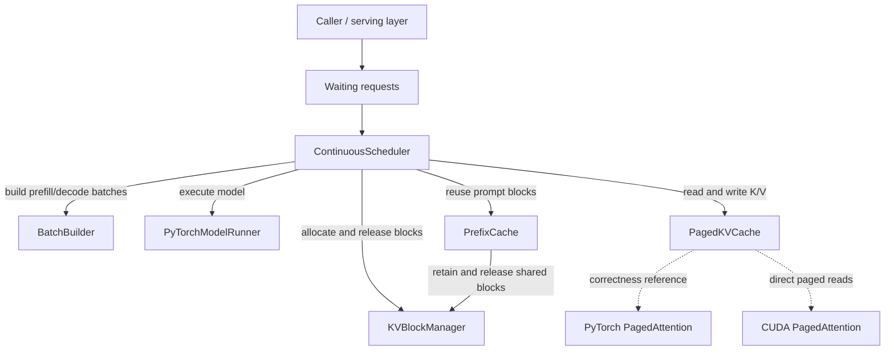
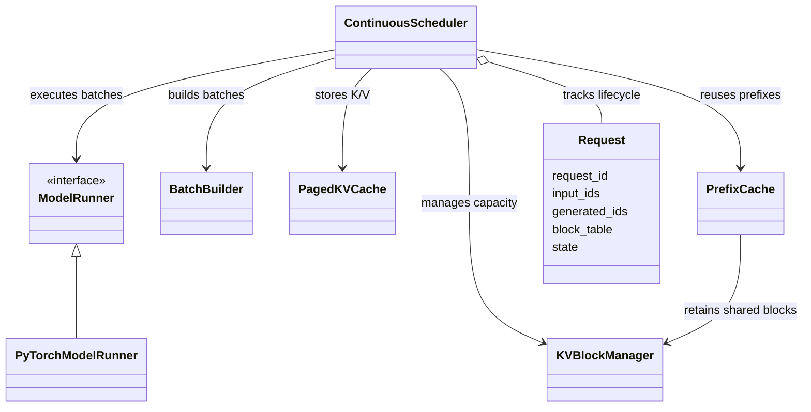

# MiniLLM Runtime

A from-scratch LLM inference runtime prototype implementing continuous batching, paged KV-cache management, prefix caching, and a custom CUDA PagedAttention kernel.

MiniLLM Runtime isolates selected mechanisms used by production inference engines and makes their behavior measurable and testable in a compact codebase. The project covers the runtime path from request scheduling and KV-cache allocation to direct paged attention on the GPU.

## Implemented features

- PyTorch/Hugging Face model runner
- Static and continuous batching
- Separate prefill and decode paths
- Variable-length batch construction
- KV block allocation, release, reuse, and reference counting
- Paged KV-cache storage with per-request block tables
- Prefix-cache lookup and shared block ownership
- Batched cached-prefill execution
- PyTorch reference PagedAttention implementation
- Minimal FP16 CUDA PagedAttention implementation
- CUDA-event and wall-clock benchmarks
- Unit, integration, real-model, and CUDA correctness tests

## Architecture

### Component graph



The scheduler owns the request lifecycle. On each tick, it admits waiting requests according to batch and KV-block capacity, schedules prefill or decode work, updates paged K/V state, and releases resources when requests finish. The PyTorch and CUDA PagedAttention paths are focused experiments over the same paged cache representation; the CUDA path is not yet integrated into `PyTorchModelRunner`.

### Core class relationships



For the CUDA experiment, a decode query reads K/V vectors directly from paged storage using the request's logical-to-physical block table:

```text
logical token -> logical block + block offset
              -> block_table[logical block]
              -> physical KV-cache address
```

This avoids first materializing the request's paged K/V blocks into a contiguous tensor.

## CUDA PagedAttention scope

The current CUDA kernel intentionally has a focused scope:

- one request per invocation;
- one decode query token;
- one transformer layer per invocation;
- FP16 inputs;
- 2 attention/KV heads;
- head dimension 64;
- KV block size 16;
- direct reads from `PagedKVCache` without calling `materialize_request_kv()`.

These fixed constraints keep the kernel understandable while still exercising block-table address translation, paged QK calculation, softmax, and weighted-value accumulation.

## Project scope

MiniLLM Runtime is a focused systems prototype rather than a production-serving framework. It prioritizes clear implementations, correctness validation, and controlled performance experiments over broad model support, distributed execution, and production deployment features.

## Repository layout

```text
app/
  attention/                 PyTorch reference PagedAttention
  benchmarks/                Application-level benchmarks
  demos/                     Real-model demonstration
  runtime/                   Scheduler, runner, and KV-cache implementation
    cuda/                    Python, C++, and CUDA PagedAttention extension
benchmarks/                  Standalone benchmark programs and results
tests/
  attention/                 Reference-attention correctness tests
  runtime/                   Runtime, integration, and CUDA tests
Summary/                     Day-by-day implementation notes and reports
```

## Key benchmark results

On an NVIDIA A10G, the one-layer FP16 benchmark compared the existing materialized path—paged KV cache → contiguous K/V tensors → PyTorch attention—with the custom CUDA kernel reading K/V directly through the block table.

| Sequence length | Materialized path | Direct CUDA PagedAttention | Speedup |
| --------------: | ----------------: | -------------------------: | ------: |
|             128 |          7.395 ms |                   0.073 ms |  101.0× |
|           1,024 |         54.590 ms |                   0.350 ms |  155.9× |
|           4,096 |        218.899 ms |                   1.319 ms |  166.0× |

Across all tested sequence lengths, direct paged attention reduced end-to-end latency by approximately **101–171×** relative to this runtime’s materialized path. Explicit KV materialization accounted for **98.42–99.95%** of the component-wise baseline and scaled from 7.192 ms at 128 tokens to 218.332 ms at 4,096 tokens.

These results demonstrate the architectural benefit of operating directly on paged KV storage; they do not imply that the prototype kernel outperforms optimized production attention kernels. The custom implementation remains slower than contiguous PyTorch attention alone, but it avoids the dominant cost of first reconstructing contiguous K/V tensors.

## Benchmark methodology

GPU operations use warm-up iterations followed by repeated measurements with CUDA events. A separate wall-clock validation synchronizes CUDA before and after each measured operation to confirm that asynchronous execution is not producing misleading timings.

Correctness is checked against contiguous attention or the PyTorch reference implementation before performance comparisons are recorded. Important runs are written to CSV so results can be compared and used in reports.

## Known limitations

- This is a focused systems prototype rather than a production server.
- The CUDA kernel currently supports single-request, single-token decode with FP16 inputs, 2 attention heads, head dimension 64, and KV block size 16.
- The real model runner uses the Hugging Face legacy KV-cache representation.
- CUDA extension compilation currently occurs when the CUDA wrapper module is imported.
- Benchmark scripts still contain some duplicated helpers and are candidates for later consolidation.

## Requirements

- Python 3.12+
- PyTorch
- Transformers
- pytest for tests
- Matplotlib for benchmark plots
- For the CUDA extension: an NVIDIA GPU, CUDA toolkit, a compatible PyTorch CUDA build, and a C++ compiler

The project has been developed with Qwen/Qwen2.5-0.5B-Instruct. Hugging Face downloads and real-model integration tests require network access or an already-cached model.

### Tested environment

The current implementation and CUDA benchmarks were validated with:

| Component | Tested version |
|---|---|
| Operating system | Ubuntu 24.04 |
| Python | 3.12.3 |
| PyTorch | 2.5.1+cu121 |
| Transformers | 4.46.3 |
| pytest | 9.1.1 |
| Matplotlib | 3.11.1 |
| GPU | NVIDIA A10G, 23 GiB |
| NVIDIA driver | 595.71.05 |
| Driver-supported CUDA | 13.2 |
| CUDA toolkit (`nvcc`) | 12.0 |
| PyTorch CUDA build | 12.1 |
| C++ compiler | GCC/G++ 13.3.0 |

The three CUDA version values describe different layers of the environment: the driver reports the newest CUDA runtime it supports, `nvcc` reports the installed compiler toolkit, and PyTorch reports the CUDA version used to build the installed wheel. They do not need to be identical.

## Installation

Create and activate a virtual environment, then install the project with development dependencies:

```bash
python3.12 -m venv .venv
source .venv/bin/activate
python -m pip install --upgrade pip
python -m pip install -e ".[dev]"
```

To include plotting support explicitly:

```bash
python -m pip install -e ".[dev,benchmark]"
```

## Running benchmarks

Static batch benchmark:

```bash
python -m app.benchmarks.static_batch_benchmark
```

Paged KV materialization benchmark:

```bash
python -m benchmarks.benchmark_materialize
```

Direct CUDA PagedAttention benchmark:

```bash
python -m benchmarks.benchmark_paged_attention
```

Analyze saved materialization results and generate the plot:

```bash
python -m benchmarks.analyze_materialize
```

Benchmark CSV files, logs, plots, and methodology notes are stored under `benchmarks/results/`.

## Running tests

Run tests that do not require a downloaded model:

```bash
python -m pytest -m "not integration" -v
```

Run real-model integration tests:

```bash
python -m pytest -m integration -v
```

Run the CUDA PagedAttention tests on a CUDA machine:

```bash
python -m pytest tests/runtime/test_paged_attention_cuda.py -v
```

The first CUDA test run may take longer because `torch.utils.cpp_extension.load()` compiles the C++/CUDA extension.
